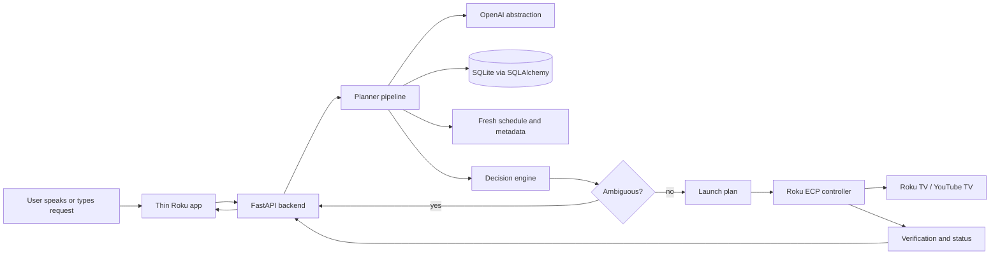

# AI TV Assistant Architecture

## Phase status

This repository is intentionally starting with the architecture phase only. No backend, Roku channel, database schema, planner implementation, updater, or tests should be generated until this architecture is reviewed and the next phase is explicitly requested.

## Product goal

The AI TV Assistant is a private, local-first control system for a Roku-branded TV running Roku OS 15.2.4 on model 55R4CX / L817X. It should let non-technical users control YouTube TV and future streaming services through natural language while feeling like an operating layer for the television rather than a chatbot.

## Guiding principles

1. Keep the Roku application thin: it displays state, captures or forwards user input, communicates with the backend, and launches Roku applications or deep links.
2. Keep intelligence in the backend: natural-language understanding, planning, disambiguation, schedule search, content resolution, and verification live in Python services.
3. Never guess when results are ambiguous: the planner must ask a clarification question whenever multiple plausible content matches exist.
4. Treat ECP deep links as best-effort: Roku External Control Protocol and YouTube TV deep-link parameters can change, so all launch paths need validation, logging, and fallback navigation.
5. Build for growth: modules, data models, configuration, and tests must be structured as if the project will exceed 100,000 lines of code.

## Proposed monorepo layout

```text
/backend
  /api          Versioned FastAPI routers, dependencies, request/response schemas.
  /ai           OpenAI API abstraction, prompt assets, model adapters, tool contracts.
  /planner      Intent extraction, entity resolution, search orchestration, decisions.
  /database     SQLAlchemy models, migrations, repositories, session management.
  /updater      Channel, metadata, schedule, sports, and provider refresh workers.
  /roku         Roku discovery, ECP client, app launcher, fallback navigation.
  /models       Shared Pydantic domain models and DTOs.
  /utils        Logging, time, config loading, retries, error helpers.
  /tests        Unit, integration, mock Roku, mock API, planner, and database tests.
/frontend
  /roku-app     Thin SceneGraph/BrightScript app for UI and backend communication.
  /assets       Roku artwork, icons, splash screens, and audio/UI assets.
/config         Environment-specific YAML/TOML configuration templates.
/docs           Architecture, ADRs, endpoint docs, database docs, operational notes.
/scripts        Developer, CI, database, fixture, and diagnostic scripts.
```

Each top-level area has one responsibility. Shared contracts flow through typed Pydantic models rather than ad hoc dictionaries.

## Runtime architecture



The backend owns the plan and the Roku controller executes it. The AI model may propose structured intent data, but it must not directly launch content.

## Planner pipeline

Every natural-language request moves through explicit stages:

1. **Input normalization**: clean transcription artifacts, preserve original text, attach locale and time context.
2. **Intent extraction**: classify requests such as live channel, sports event, episode, movie, search, playback control, or diagnostics.
3. **Entity extraction**: identify channels, networks, teams, leagues, programs, dates, relative times, and preferences.
4. **Entity resolution**: map text to database records using aliases, confidence scores, and user preferences.
5. **Database search**: query channels, programs, schedules, sports events, shows, episodes, movies, and historical conversation context.
6. **Schedule search**: evaluate current, upcoming, and recently aired programming windows.
7. **Decision engine**: choose exactly one candidate, ask a clarification question, or explain that no reliable match exists.
8. **Launch plan generation**: build a typed launch plan with app identifier, content ID, media type, fallback strategy, and verification criteria.
9. **Execution**: send Roku ECP launch, input, or keypress commands through the Roku controller.
10. **Verification**: query active app status where possible and record whether the launch was confirmed, uncertain, or failed.

The planner must produce auditable intermediate artifacts so failures can be inspected without replaying the full interaction.

## Data architecture

SQLite is the initial database because the project is private, local, and easy to back up. The schema should still be normalized and indexed for millions of schedule rows.

Core table groups:

- **Catalog**: networks, channels, channel aliases, providers, provider channel mappings.
- **Programs**: programs, shows, seasons, episodes, movies, genres, people, external IDs.
- **Schedules**: schedule entries, airings, source snapshots, update batches, change history.
- **Sports**: leagues, teams, venues, games, broadcasts, season metadata.
- **Users**: user profiles, preferences, accessibility settings, favorite channels, blocked content.
- **Conversation**: conversation sessions, turns, planner traces, clarification state.
- **Settings**: devices, apps, ECP capabilities, feature flags, provider credentials references.

Schedule tables should use composite indexes on channel/time, program/time, sports league/time, and source update batch. Full-text search should be considered for program titles, aliases, and descriptions.

## Roku controller architecture

The Roku controller is a backend subsystem, not AI logic inside BrightScript. Responsibilities include:

- Discover Roku TVs on the LAN and store device metadata.
- Query installed apps and active app state through ECP.
- Launch apps and deep links with `contentId` and `mediaType` parameters.
- Send keypress and input commands for fallback navigation.
- Handle power and volume capabilities when supported.
- Retry transient network failures with bounded backoff.
- Log every command with request ID, target device, status code, latency, and result classification.
- Expose mockable interfaces for tests so development never requires physical Roku hardware.

YouTube TV launching should support both discovered numeric app IDs and known channel codes when available. Deep links must remain data-driven because content IDs and media types may be provider-specific or unstable.

## Updater architecture

Updater services are separate from request/response API handling. They refresh data, write update batches, and allow rollback when a provider returns bad data.

Initial updater responsibilities:

- Refresh Roku app inventory and device capabilities.
- Refresh channel lineups and aliases for the configured market.
- Refresh program metadata and schedule windows.
- Refresh sports teams, leagues, events, and broadcasts.
- Detect changed content IDs, missing channels, and stale schedules.
- Preserve historical snapshots for debugging and regression tests.
- Support additional providers beyond YouTube TV through provider adapters.

Undocumented provider endpoints must be isolated behind adapters with clear failure modes and fallbacks to licensed or user-configured schedule sources.

## API architecture

All APIs are versioned under `/api/v1`. Initial endpoint groups should include:

- `POST /speech`: accept speech text or references to captured audio and return assistant responses.
- `POST /planner/plan`: produce a plan without executing it for debugging and tests.
- `POST /planner/execute`: execute an approved launch plan.
- `POST /launch`: launch app or content directly through a typed request.
- `GET /status`: return current backend, device, and active app status.
- `POST /refresh`: trigger updater jobs.
- `GET /search`: search catalog, channels, schedules, and programs.
- `GET /health`: lightweight health check.
- `GET /diagnostics`: detailed configuration, provider, database, and Roku diagnostics.
- `GET /configuration`: expose safe runtime configuration values.
- `GET /conversation/{session_id}`: inspect conversation history and clarification state.

Endpoint handlers should be thin and delegate to services through dependency injection.

## Configuration strategy

No operational value should be hardcoded. Configuration files should own API keys, provider settings, device addresses, ports, paths, timeouts, model names, logging levels, retry limits, market settings, and user preferences. Secrets should be referenced through environment variables or local secret files excluded from Git.

## Logging and observability

The backend should use structured logging from the beginning. Every log entry should include a subsystem, request ID where available, session ID where available, and enough context to diagnose failures without leaking secrets. Planner traces should be persisted separately from application logs so they can be used in tests and debugging.

## Testing strategy

Testing starts with architecture boundaries and grows with each phase:

- Unit tests for pure planner stages, configuration loading, Pydantic validation, and repository queries.
- Integration tests for FastAPI endpoints, SQLite migrations, updater batches, and planner execution.
- Mock Roku tests for ECP launch, query, keypress, timeout, and retry behavior.
- Mock provider tests for channel and schedule updater adapters.
- Golden planner tests for ambiguous requests, no-match responses, and launch-plan generation.
- Database tests that verify indexes, constraints, and high-volume schedule query performance.

Every phase should compile, type-check, and test before moving to the next phase.

## Phase plan

1. **Architecture**: document system boundaries, responsibilities, data flow, risks, and next decisions.
2. **Folder structure**: create the monorepo skeleton, package markers, configuration templates, and developer tooling placeholders.
3. **Database**: implement SQLAlchemy models, migrations, repositories, seed fixtures, and database tests.
4. **Backend foundation**: implement FastAPI app, config loading, logging, health, diagnostics, and dependency injection.
5. **Roku communication**: implement ECP discovery, app queries, launches, keypress fallback, retries, mocks, and tests.
6. **Planner**: implement explicit planner stages, OpenAI abstraction, clarification behavior, launch plans, and golden tests.
7. **Updater**: implement provider adapters, update batches, rollback, schedule refresh, and integration tests.
8. **Roku app**: implement thin SceneGraph UI, backend communication, status display, and launch feedback.
9. **Documentation**: expand operational docs, endpoint docs, database docs, troubleshooting, and user guides.

Do not skip phases. The next requested phase should be folder structure only.

## Key risks and mitigations

| Risk | Impact | Mitigation |
| --- | --- | --- |
| YouTube TV deep-link behavior changes | Launches may open the app but not requested content | Cache verified IDs, monitor failures, provide fallback navigation, and keep launch logic data-driven. |
| Ambiguous natural language | Wrong content could launch | Require clarification whenever multiple plausible matches exist. |
| Schedule data gaps | Planner cannot resolve sports, episodes, or recent games | Support multiple provider adapters and expose no-match explanations. |
| Roku app isolation | The assistant cannot inspect another app's UI | Keep verification conservative and rely on ECP active app plus user-visible feedback. |
| Local network changes | Device IP may change | Implement discovery, persistent device records, and reconnect diagnostics. |
| Undocumented APIs | Updaters may break unexpectedly | Isolate adapters, record snapshots, and allow manual overrides. |

## Open decisions before implementation

1. Which package manager and lock strategy should be used for Python 3.13.
2. Whether migrations should use Alembic immediately or begin with SQLAlchemy metadata creation for the first local phase.
3. Which external schedule provider, if any, should be configured before experimenting with YouTube TV schedule endpoints.
4. Whether the Roku app should initially capture speech, accept text only, or integrate both paths.
5. Which OpenAI model should be the default once the AI abstraction is implemented.
